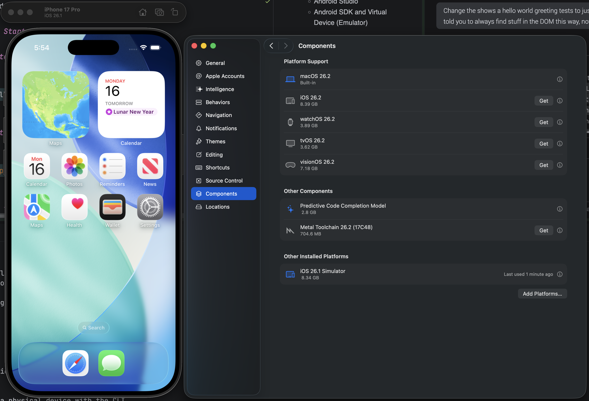

# React Native Boilerplate

## How to use this
1. make sure your init.sh (or `init.sh`) is marked as executable in your boilerplate repo (chmod +x init.sh). This ensures the AI agent doesn't get hung up on a "Permission Denied" error when it tries to run the bootstrap.
2. Start a new folder for your new project: `mkdir my-new-tool && cd my-new-tool`
3. Open Junie/Codex: Say, "Start working on the Etsy SEO parser." (or whatever you named your project)
4. The Agent Acts: * The agent reads AGENTS.md and sees the "Standing Order."
5. It notices the folder is empty and runs `../react-native-boilerplate/init.sh`.

Result: Your boilerplate is synced, yarn is finished, and a private GitHub repo is already created and pushed before the agent even writes the first line of your SEO parser.

## Benefits to using this repo
**Atomic Logic**: It links your manual tasks.md workflow to the agent's automated behavior.

**Tool-Agnostic**: Whether you use Junie, Codex, or a future CLI tool, they will all follow the same "Bootstrap -> Code -> Sync" loop.

**Zero-Friction**: You can now open a brand new folder, ask the agent to build a specific component, and the agent will handle the boilerplate, the dependencies, and the GitHub repo creation as its very first set of actions.

## AGENTS.md
`AGENTS.md` is checked by the agent at the start of every session
Why this is a "Force Multiplier" for your workflow:

**Standardization**: Because AGENTS.md is an open standard, if you ever use a CLI tool (like Codex) to run a "Full-Auto" refactor, it will see this checklist and execute it as a final validation step.

**Context Control**: By using the @ mentions, you're signaling to Junie's Brave mode exactly which files are high-priority. It reduces the chance of the AI ignoring your guidelines in favor of generic "AI-style" code.
- In the context of AI coding agents like Junie, Codex, or Cursor, an @ mention is a special syntax used to explicitly "attach" a file, folder, or documentation to the conversation.

**The "Seeding" Benefit**: Since you use a repo to seed new apps, having this AGENTS.md in your boilerplate ensures that every new project inherits these exact quality controls. You won't have to set up Junie's project settings every single time; it will "discover" these rules automatically.


### How your app is bootstrapped automatically
- Junie (in Brave mode) or Codex or whatever tool you use will read AGENTS.md, see that it's a new project without the Tailwind config, and say: "I noticed the project isn't initialized. I'm running the sync script first."
- `react-native-boilerplate` repo contains a shell script that utilizes uses rsync, which is the industry standard for "smart" merging
- After we use the bootstrapped code in a new app, whenever we want to update the bootstrap (make react-app-boilerplate smarter or provide more), by having the `init.sh` script in `react-app-boilerplate`'s AGENTS.md rule, you can just tell the agent: "Update the boilerplate in this project," and it will run the sync script, bringing in only the new improvements while leaving your app code untouched
- By keeping the AGENTS.md updated, you ensure that Junie (in Brave mode) or Codex knows it has the green light to run this script whenever it detects the project is uninitialized

### init.sh
The `rsync -au` flag ensures that if you’ve already started customizing the code in your new app, the script won't revert your changes back to the generic boilerplate version.

### If using Junie
- Junie (in Brave mode) reads the AGENTS.md first. Therefore it'll also bootstrap this project automatically if it hasn't already
  - Silent Execution: It will perform the copy and the merge as part of its "Plan" phase before it ever touches your SVG code.
  - also If you accidentally delete a vital config file while working, the agent will notice the "Bootstrap Check" is no longer met and restore the missing piece from the boilerplate repo automatically.
- Context Loading: When you start a new session, Junie reads AGENTS.md. It sees the @ mentions and immediately pulls those three files into its "active memory."
- Conflict Resolution: If Junie suggests a "clever" solution that violates your GUIDELINES.md, you can simply say, "Check the guidelines again," and it will correct itself because you've explicitly defined that file as the manual.
- Task Discipline: By making tasks.md a "Mandatory Log," Junie will stop trying to do 5 things at once and stay focused on the specific task you’ve assigned in your iterative loop.

#### @ Mentions
Whenever you want to tell Junie or a tool to look at a file use `@` so that it prioritizes it over other files. e.g. `please read @GUIDELINES.md`
It tells the agent's Context Loader to fetch that file every single time a new task starts

How to use them in JetBrains/Junie:
Open the Junie chat.

Type `@`.

Select your `PROJECT_SPEC.md`.

Type your request.

# Starting the Hello World Emulator
## Prerequisites

Before you begin, ensure you have the following installed on your local machine:

- **Node.js** (>=18)
- **Yarn**
- **Watchman** (recommended for macOS)
- **For iOS development:**
  - Xcode (Install via App Store or [developer.apple.com](https://developer.apple.com/xcode/))
  - **Important:** A full installation of Xcode is required to run the iOS Simulator. If you only have Command Line Tools installed, `yarn ios` will fail with "iOS devices or simulators not detected".
    - open Xcode → Settings (or Preferences) → Platforms and download an iOS Simulator runtime.
  - Ensure Command Line Tools are correctly configured. If you have Xcode installed, run:
    ```bash
    sudo xcode-select -s /Applications/Xcode.app/Contents/Developer
    ```
    *Note: If your Xcode is installed in a different location, adjust the path accordingly. If you only have Command Line Tools installed, `xcode-select -p` should point to `/Library/Developer/CommandLineTools`.*
  - Verify the simulator tooling sees devices `xcrun simctl list devices`
  - If you run into isssues running the simulator,try running `npx react-native doctor`
  - CocoaPods (`sudo gem install cocoapods`)
  - After that, `xcrun simctl list` should show devices, and your React Native/Expo iOS simulator runs should work.
  - Download and install a simulator.  Open Xcode and to go Components and add a Platform
  - **Troubleshooting "iOS devices or simulators not detected":**
    1. Open Xcode.
    2. Go to **Settings > Platforms**.
    3. Ensure an iOS SDK is installed.
    4. Go to **Settings > Locations** and ensure the Command Line Tools dropdown selects your Xcode version.
    5. Run `xcrun simctl list runtimes` to verify available iOS runtimes.
    6. Run `xcrun simctl list devices` to see available simulators. If none exist, create one in Xcode (Window > Devices and Simulators).
- **For Android development:**
  - Android Studio
  - Android SDK and Virtual Device (Emulator)

## Getting Started

### 1. Install Dependencies

```bash
yarn install
```

### 2. Install iOS Pods (macOS only)

```bash
cd ios && pod install && cd ..
```

## Running the Application

### Start the Metro Bundler

The Metro bundler is the JavaScript bundler for React Native. Start it in its own terminal window:

```bash
yarn start
```

### Run on iOS

In a new terminal window, run:

```bash
yarn ios
```

*Note: This will attempt to launch the iOS Simulator. Ensure you have added at least one platform at the buttom in the Components tab in XCode Settings*




### Run on Android

In a new terminal window, run:

```bash
yarn android
```

*Note: This will attempt to launch the Android Emulator.*

## Testing

This project uses **Jest** and **React Native Testing Library**.

To run all tests:

```bash
yarn test
```

To run tests in watch mode:

```bash
yarn test --watch
```

## Project Structure

- `App.tsx`: Main application component.
- `index.js`: App entry point.
- `__tests__/`: Contains unit and UI tests.
- `ios/` & `android/`: Native project folders.
- `app.json`: Application metadata.
